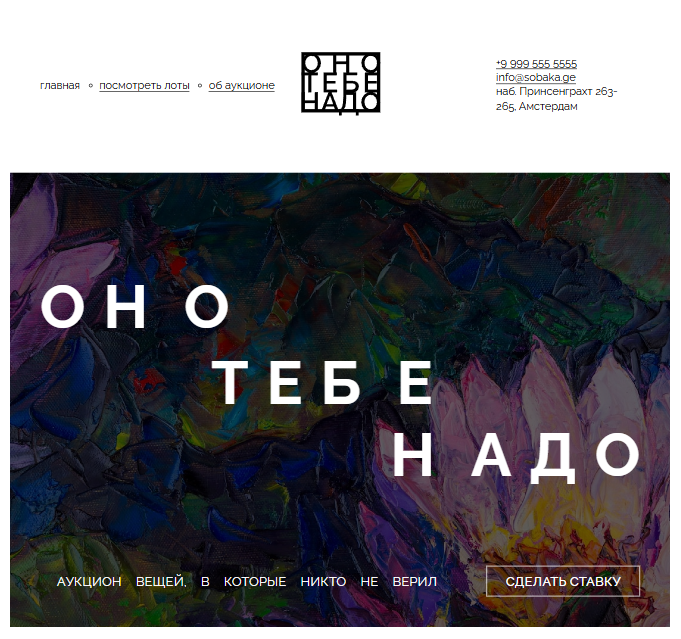

# Сайт аукциона «Оно тебе надо»

Главная страница сайта онлайн-аукциона «Оно тебе надо» - аукциона вещей, в которые никто не верил.

Данный проект был создан для освоения основ верстки с применением семантических тегов, flex- и grid-раскладок и техник позиционирования. В проекте использовалась БЭМ-методология. Целью проекта было получить практический опыт в верстке web-страниц.

[Сайт на github-pages](https://anna-kobis.github.io/ono-tebe-nado/) | [Макет в Figma](https://www.figma.com/design/8KwhMpv8qnDocX4NVFQBpn)

## Стек технологий

- Верстка на HTML5 и CSS3.
